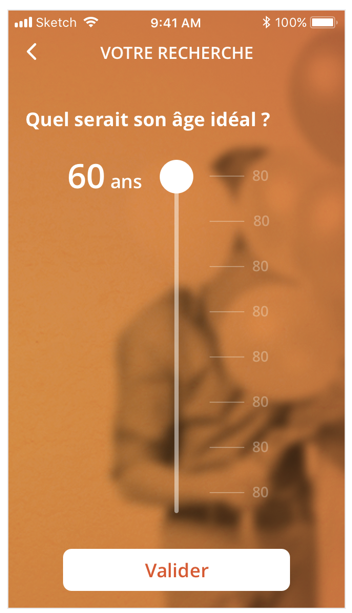

# Interview

## 🥅Goal

Reproduce this page:

- without the navigation (header, "Votre recherche")
- without image in background (you can use plain orange)
- with a title: "Quelle serait sa taille ?"
- with a scale from "1m" to "2m20"

**Rules:**  📏

- when you drag the handle, the current value is stored in redux
- when you click on validate, you do an http post to `https://postman-echo.com/posts`

**Bonus point**: 🏆

- the min, max and value is persisted across app restart

## Getting started ⏰

- `npm install -g expo-cli`
- `git clone` (et pas de fork)
- `git remote set-url origin a-repo-git-that-you-create`
- `git branch feat/add-handler`
- `yarn install`
- `yarn start`
- code :)
- multiple `git commit`

- open a PR and contact me with github url and expo link (eg https://exp.host/@tychota/interview-test)

## My evaluation

- quality of commit (naming, small commits)
- quality of code (linters, tests: unit and/or e2e, naming of variables, refactoring)
- quality of the final UX (vertical bar centred, scale step aligned with the center of the handle: when handle is at 1m20, it aligns with the 1m20 scale step)

You can (and are encouraged to ask me questions). I will see how you communicate and work with team.

> Small tip for asking questions:
>
> - what is the context
> - what did you expect
> - what did you have in reality
> - what you already looked at
